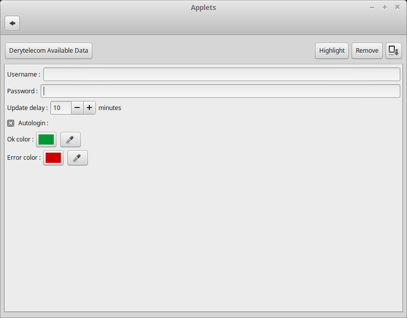

Derytelecom Available Data: A Cinnamon applet
===============================================================================

This applet is a text applet that allows to query and display how many data are
still available for the current month for the Derytelecom ISP.

Installation
-------------------------------------------------------------------------------
To install, download this applet and decompress it
in ~/.local/share/cinnamon/applets

For the autologin feature you will also need to install
[PyUserInput](https://github.com/PyUserInput/PyUserInput)

Configuration
-------------------------------------------------------------------------------
### Configuration window

### Explanations of the differents options
* Username: Allow to specify the username to use to log on the Derytelecom
Extranet
* Password: Allow to specify the password to use to log on the Derytelecom
Extranet
* Update delay: Delay before updating the text of this applet by contacting the
Derytelecom Extranet to retrieve the available data
* Autologin: Activate the autologin feature
* Ok color: The color of the text when there is no problem reaching the
Derytelecom Extranet
* Error color: The color of the text when there is an error reaching the
Derytelecom Extranet

How to use
-------------------------------------------------------------------------------
To use this applet, you just need to provide a *Username* and *Password* in its
configuration. This information will be used to log on the
Derytelecom Extranet and retrieve the *available data*. This operation is
carried out repeatedly after a delay equal to the value of the
*Update delay* option in the configuration. The *available data* is displayed
as the value of this applet (which is a text applet). The color of the text
depends on whether the last communication with the Derytelecom Extranet was
successful or not. If it was successful, the text will be green
(), if not, it will be red
(). These colors can be
changed in the configuration.

Another feature of this applet is that you can open the Derytelecom Extranet
login page in the web browser by clicking on it. If you have
[PyUserInput](https://github.com/PyUserInput/PyUserInput) installed and the
*Autologin* option is checked in the configuration, this applet will
automatically log you in.

Usefulness of this applet
-------------------------------------------------------------------------------
As this applet is really specific, I don't think it will be really useful to
anyone. Still, I think that the source code can be really interesting to anyone
who would like to write an applet that perform a similar task. With that in
mind, I have documented a huge part of the source code. Hopefully, someone will
be able to get something out of it!

License
------------------------------------------------------------------------------
derytelecomavailabledata is licensed under the [MIT License](LICENSE).
